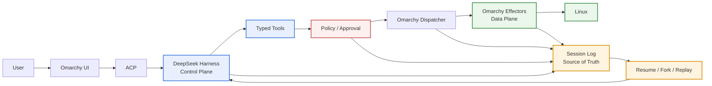

# Omarchy

Omarchy is a beautiful, fun & agentic Linux distribution by DHH.

This tree additionally treats [DeepSeek Harness](https://github.com/deepseek-ai/deepseek-harness) as the session **Control Plane**: the user still operates Omarchy; AI action reaches Linux only through typed tools, policy, and Omarchy effectors (the **Data Plane**); agent-caused facts live in one **Session Log**. Rev 6 / Phase 2 Freeze is the session-control-plane baseline. Rev 9 opens Phase 3 L2. Pending approvals punch DND with an `omarchy-action` card that summons the overlay; allow/deny still go through the host. Generic execute, shell, and `/etc`/`/usr` stay unrepresentable. The design is [`plans/harness.md`](plans/harness.md).



Read more at [omarchy.org](https://omarchy.org).

## Running the Harness (dsh) from a Mac

The full stack from a bare Apple Silicon Mac: [Try Omarchy](https://github.com/chenxingqiang/try-omarchy)
runs the Omarchy desktop as a native QEMU app, the harness boots inside it,
and dsh runs as the default agent in a resident Docker container that reaches
the Mac's LLM gateway (`witmem-gw.local:8443`, self-signed CA trusted via
`NODE_EXTRA_CA_CERTS`).

### 1. Build and launch the try-Omarchy VM

```sh
git clone https://github.com/chenxingqiang/try-omarchy && cd try-omarchy
make build          # doctor -> guest image -> QEMU runtime -> Swift app
open dist/*.app      # launches the VM window (first boot creates user johnson)
```

Loopback port forwarding is built in: `ssh -p 2222 johnson@127.0.0.1`
reach the VM. Install your Mac public key on first login (password login
is enabled on first boot):

```sh
ssh-copy-id -p 2222 johnson@127.0.0.1
```

### 2. Provision the VM

```sh
ssh -p 2222 johnson@127.0.0.1
sudo pacman -Syu --noconfirm docker git
sudo systemctl enable --now docker
sudo usermod -aG docker johnson && exit   # re-login to pick up the group

# Fetch this repo (the harness) into the VM:
ssh -p 2222 johnson@127.0.0.1 'git clone -b quattro \
  https://github.com/chenxingqiang/omarchy-harness-linux ~/omarchy-harness-linux'
```

If the VM needs an HTTP proxy for outbound traffic, set it in
`/etc/environment` (`http_proxy=...`) — the QEMU user network reaches the
Mac's proxy via `10.0.2.2`.

### 3. Build and start the agentENV container

```sh
ssh -p 2222 johnson@127.0.0.1
cd ~/omarchy-harness-linux/harness
sudo docker build -f docker/Containerfile -t omarchy-agentenv .   # needs docker/.credentials.yaml (not in git)
sudo docker run -d --name agentenv --restart unless-stopped \
  --network host omarchy-agentenv
curl -s http://127.0.0.1:8377 >/dev/null && echo "agentENV up"
```

The container materializes the `agentenv` dsh profile (dsh-base +
dsh-web-app) on boot and serves the Web UI on `127.0.0.1:8377`; the gateway
name `witmem-gw.local` resolves to `10.0.2.2` (the QEMU host alias), so the
self-signed certificate's DNS SAN matches.

### 4. Make dsh the default agent (first-class wiring)

```sh
ssh -p 2222 johnson@127.0.0.1
# Dispatcher scripts (omarchy-agent knows the dsh case; default-agent accepts it):
sudo cp ~/omarchy-harness-linux/bin/omarchy-agent /usr/bin/
sudo cp ~/omarchy-harness-linux/bin/omarchy-default-agent /usr/bin/

# The dsh wrapper: headless one-shot forwards into the container, anything
# else points at the resident Web UI (there is no shipped TUI profile):
mkdir -p ~/.local/bin && cat > ~/.local/bin/dsh <<'EOF'
#!/bin/bash
if [[ ${1:-} == "--profile" && ${2:-} == "headless" && -n ${3:-} && ${3:-} != -* ]]; then
  exec docker exec -i agentenv /opt/harness/node_modules/.bin/dsh --profile headless "$3"
fi
url=http://127.0.0.1:8377
echo "dsh interactive UX is the Web UI: $url (resident agentenv instance)"
command -v xdg-open >/dev/null 2>&1 && xdg-open "$url" >/dev/null 2>&1
EOF
chmod +x ~/.local/bin/dsh
sudo ln -sf ~/.local/bin/dsh /usr/local/bin/dsh

omarchy default agent dsh
```

Then add the natural-language fallback to `~/.bashrc` (multi-word or
single non-ASCII word -> ask the agent):

```bash
command_not_found_handle() {
  if [ $# -gt 1 ] || { [ $# -eq 1 ] && printf %s "$1" | LC_ALL=C grep -q "[^ -~]"; }; then
    echo "-> not a command, asking the default agent (dsh)..." >&2
    omarchy agent prompt "$*"
  else
    return 127
  fi
}
```

### 5. Use it

```sh
# Browser (the official dsh interactive UX) — from the Mac:
ssh -p 2222 -f -N -L 8377:127.0.0.1:8377 johnson@127.0.0.1   # SSH tunnel
open http://127.0.0.1:8377

# Terminal inside the VM (desktop terminal window):
a                                    # opens the resident Web UI
omarchy agent prompt "check disk"    # one-shot answer via dsh
怎么查看内存占用                      # natural language -> dsh answers

# Headless one-shot straight from the Mac:
ssh -p 2222 johnson@127.0.0.1 'omarchy-agent --inline --prompt "hi"'

# Scale pilot (10/50/10000 tasks, bounded concurrency):
ssh -p 2222 johnson@127.0.0.1 'harness/docker/pilot-run.sh 50'

# Container management:
ssh -p 2222 johnson@127.0.0.1 'sudo docker logs -f agentenv'
ssh -p 2222 johnson@127.0.0.1 'sudo docker restart agentenv'
```

Container material lives in [`harness/docker/`](harness/docker/)
(Containerfile, entrypoint, model settings; `.credentials.yaml` is built
locally and never committed). The VM-side dsh wrapper is
`~/.local/bin/dsh` (also linked at `/usr/local/bin/dsh`).

## The Omarchy Manual

The manual lives in [`manual/`](manual/), which is its authoritative source. It's
mirrored to [learn.omacom.io](https://learn.omacom.io/2/the-omarchy-manual), where
its screenshots are also hosted.

- [Welcome to Omarchy!](manual/01-welcome-to-omarchy.md)

**The Basics**

- [Getting Started](manual/02-getting-started.md)
- [Coming From Mac or Windows](manual/03-coming-from-mac-or-windows.md)
- [Navigation](manual/04-navigation.md)
- [The top bar](manual/05-the-top-bar.md)
- [Themes](manual/06-themes.md)
- [Hotkeys](manual/07-hotkeys.md)
- [Unified Clipboard & History](manual/08-unified-clipboard-history.md)
- [Reminders](manual/09-reminders.md)
- [Notices](manual/10-notices.md)
- [Text Extraction & Dictation](manual/11-text-extraction-dictation.md)
- [Screenshots & Recording](manual/12-screenshots-recording.md)
- [Toggles, idle & screensaver](manual/13-toggles-idle-screensaver.md)
- [Omarchy CLI](manual/14-omarchy-cli.md)

**The Applications**

- [Terminal](manual/15-terminal.md)
- [Neovim](manual/16-neovim.md)
- [AI](manual/17-ai.md)
- [Development Tools](manual/18-development-tools.md)
- [Shell Tools](manual/19-shell-tools.md)
- [Shell Functions](manual/20-shell-functions.md)
- [TUIs](manual/21-tuis.md)
- [GUIs](manual/22-guis.md)
- [Browsers](manual/23-browsers.md)
- [Commercial apps/services](manual/24-commercial-apps-services.md)
- [Web Apps](manual/25-web-apps.md)
- [Gaming](manual/26-gaming.md)
- [Filling out PDFs](manual/27-filling-out-pdfs.md)
- [Windows VM](manual/28-windows-vm.md)
- [Other Packages](manual/29-other-packages.md)

**Configuration**

- [Updates](manual/30-updates.md)
- [Dotfiles](manual/31-dotfiles.md)
- [Shell plugins](manual/32-shell-plugins.md)
- [Monitors](manual/33-monitors.md)
- [Keyboard, Mouse, Trackpad](manual/34-keyboard-mouse-trackpad.md)
- [Networking](manual/35-networking.md)
- [System sleep](manual/36-system-sleep.md)
- [Hardware authentication](manual/37-hardware-authentication.md)
- [Fonts](manual/38-fonts.md)
- [Backgrounds](manual/39-backgrounds.md)
- [Prompt](manual/40-prompt.md)
- [Branding](manual/41-branding.md)
- [Common tweaks](manual/42-common-tweaks.md)
- [Making your own theme](manual/43-making-your-own-theme.md)

**The Rest**

- [Mac support](manual/44-mac-support.md)
- [Troubleshooting](manual/45-troubleshooting.md)
- [FAQ](manual/46-faq.md)
- [System snapshots](manual/47-system-snapshots.md)
- [Security](manual/48-security.md)
- [Omarchy on...](manual/49-omarchy-on.md)
- [Dual Boot Install](manual/50-dual-boot-install.md)
- [Unattended Installs](manual/51-unattended-installs.md)

## License

Omarchy is released under the [MIT License](https://opensource.org/licenses/MIT).
