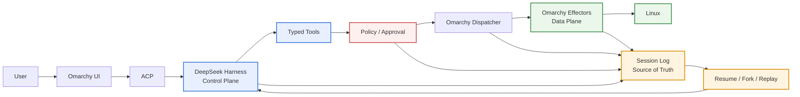

# Omarchy

Omarchy is a beautiful, fun & agentic Linux distribution by DHH.

This tree additionally treats [DeepSeek Harness](https://github.com/deepseek-ai/deepseek-harness) as the session **Control Plane**: the user still operates Omarchy; AI action reaches Linux only through typed tools, policy, and Omarchy effectors (the **Data Plane**); agent-caused facts live in one **Session Log**. Rev 6 / Phase 2 Freeze is the session-control-plane baseline. Rev 9 opens Phase 3 L2. Pending approvals punch DND with an `omarchy-action` card that summons the overlay; allow/deny still go through the host. Generic execute, shell, and `/etc`/`/usr` stay unrepresentable. The design is [`plans/harness.md`](plans/harness.md).



Read more at [omarchy.org](https://omarchy.org).

## Running the Harness (dsh) from a Mac

The DeepSeek Harness runs as the default agent inside the try-omarchy VM
(QEMU, SSH on port 2222). The agent daemon is a resident Docker container
(`agentenv`, auto-started on VM boot) that reaches the local LLM gateway
(`witmem-gw.local:8443`, trusted via `NODE_EXTRA_CA_CERTS`).

```sh
# 1. Browser (Web UI is the official dsh interactive UX):
ssh -p 2222 -f -N -L 8377:127.0.0.1:8377 johnson@127.0.0.1   # SSH tunnel
open http://127.0.0.1:8377

# 2. Terminal inside the VM (desktop terminal window):
a                                    # opens the resident Web UI
omarchy agent prompt "check disk"    # one-shot answer via dsh
怎么查看内存占用                      # natural language -> dsh answers

# 3. Headless one-shot straight from the Mac:
ssh -p 2222 johnson@127.0.0.1 'omarchy-agent --inline --prompt "hi"'

# 4. Scale pilot (10/50/10000 tasks, bounded concurrency):
ssh -p 2222 johnson@127.0.0.1 'harness/docker/pilot-run.sh 50'

# 5. Container management:
ssh -p 2222 johnson@127.0.0.1 'sudo docker logs -f agentenv'
ssh -p 2222 johnson@127.0.0.1 'sudo docker restart agentenv'
```

Container material lives in [`harness/docker/`](harness/docker/)
(Containerfile, entrypoint, model settings); the VM-side dsh wrapper is
`~/.local/bin/dsh` (also linked at `/usr/local/bin/dsh`).

## The Omarchy Manual

The manual lives in [`manual/`](manual/), which is its authoritative source. It's
mirrored to [learn.omacom.io](https://learn.omacom.io/2/the-omarchy-manual), where
its screenshots are also hosted.

- [Welcome to Omarchy!](manual/01-welcome-to-omarchy.md)

**The Basics**

- [Getting Started](manual/02-getting-started.md)
- [Coming From Mac or Windows](manual/03-coming-from-mac-or-windows.md)
- [Navigation](manual/04-navigation.md)
- [The top bar](manual/05-the-top-bar.md)
- [Themes](manual/06-themes.md)
- [Hotkeys](manual/07-hotkeys.md)
- [Unified Clipboard & History](manual/08-unified-clipboard-history.md)
- [Reminders](manual/09-reminders.md)
- [Notices](manual/10-notices.md)
- [Text Extraction & Dictation](manual/11-text-extraction-dictation.md)
- [Screenshots & Recording](manual/12-screenshots-recording.md)
- [Toggles, idle & screensaver](manual/13-toggles-idle-screensaver.md)
- [Omarchy CLI](manual/14-omarchy-cli.md)

**The Applications**

- [Terminal](manual/15-terminal.md)
- [Neovim](manual/16-neovim.md)
- [AI](manual/17-ai.md)
- [Development Tools](manual/18-development-tools.md)
- [Shell Tools](manual/19-shell-tools.md)
- [Shell Functions](manual/20-shell-functions.md)
- [TUIs](manual/21-tuis.md)
- [GUIs](manual/22-guis.md)
- [Browsers](manual/23-browsers.md)
- [Commercial apps/services](manual/24-commercial-apps-services.md)
- [Web Apps](manual/25-web-apps.md)
- [Gaming](manual/26-gaming.md)
- [Filling out PDFs](manual/27-filling-out-pdfs.md)
- [Windows VM](manual/28-windows-vm.md)
- [Other Packages](manual/29-other-packages.md)

**Configuration**

- [Updates](manual/30-updates.md)
- [Dotfiles](manual/31-dotfiles.md)
- [Shell plugins](manual/32-shell-plugins.md)
- [Monitors](manual/33-monitors.md)
- [Keyboard, Mouse, Trackpad](manual/34-keyboard-mouse-trackpad.md)
- [Networking](manual/35-networking.md)
- [System sleep](manual/36-system-sleep.md)
- [Hardware authentication](manual/37-hardware-authentication.md)
- [Fonts](manual/38-fonts.md)
- [Backgrounds](manual/39-backgrounds.md)
- [Prompt](manual/40-prompt.md)
- [Branding](manual/41-branding.md)
- [Common tweaks](manual/42-common-tweaks.md)
- [Making your own theme](manual/43-making-your-own-theme.md)

**The Rest**

- [Mac support](manual/44-mac-support.md)
- [Troubleshooting](manual/45-troubleshooting.md)
- [FAQ](manual/46-faq.md)
- [System snapshots](manual/47-system-snapshots.md)
- [Security](manual/48-security.md)
- [Omarchy on...](manual/49-omarchy-on.md)
- [Dual Boot Install](manual/50-dual-boot-install.md)
- [Unattended Installs](manual/51-unattended-installs.md)

## License

Omarchy is released under the [MIT License](https://opensource.org/licenses/MIT).
