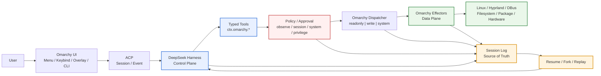
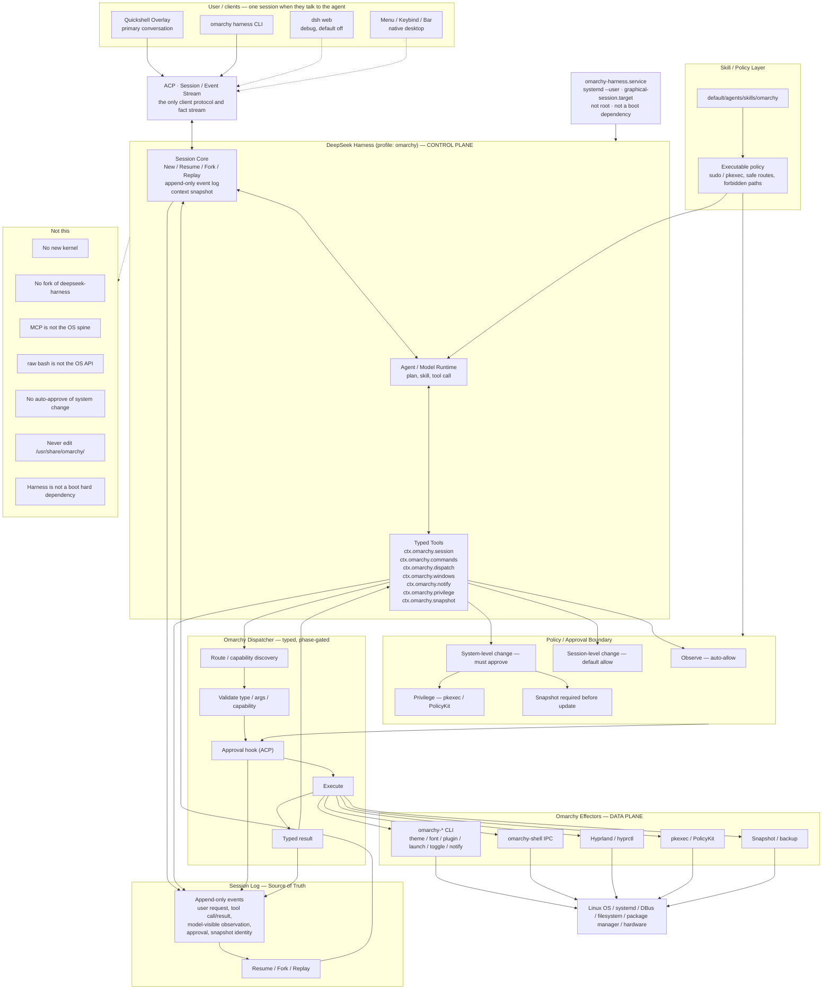

# Plan: Omarchy Harness — the OS as a DeepSeek Harness profile

Revision 6 is the **Phase 2 freeze point**. Rev 7 is the **L1 surface review**. The v0 table now lives in `harness/lib/mutations.js` as a closed, non-executable catalog. Frozen architecture is not reopened. **Phase 3 is not opened and not authorized.** `dispatch.write` still does not exist. Mermaid diagrams are unchanged.

**Status:** Rev 6 / Phase 2 Freeze remains the baseline. Rev 7 classifies a finite L1 set and proves L2 is unrepresentable on that set. The sole Phase 3 proof, when that phase opens, is: **even with `dispatch.write` fully available, Harness still cannot cross L1 → L2.**

**Thesis:** the user still operates Omarchy. Harness does not take over the desktop. It is the session Control Plane. AI action reaches Linux only as typed tools → policy → dispatcher → Omarchy effectors (the Data Plane). Facts that the agent caused or that the model saw go into one Session Log, so a turn can Resume / Fork / Replay.

```text
                    Session Log
                   /     |      \
                  /      |       \
             Resume     Fork    Replay
                  \      |       /
                   \     |      /
                 DeepSeek Harness
                        │
                   Typed Tools
                        │
                  Policy / Approval
                        │
                  Omarchy Dispatcher
                        │
                  Omarchy Data Plane
```

## Architecture

Four concepts, not a module inventory: **Control Plane**, **Data Plane**, **Session Log**, **Policy Boundary**.

The compact map of that mainline:



Native Menu / Keybind / Bar may act on the Data Plane directly. Those effects are not Harness facts. Overlay, `omarchy harness` CLI, and (optional) `dsh web` are ACP clients of the same session. A keybind only enters this diagram when it summons a turn or a Harness surface.

The engineering view of the same four concepts:



Dispatch is the same choke point in both pictures, and it is **not** one function that later grows an allowlist. Phase 1 is observe-only. Phase 2 writes the Harness session (and runs approval against those writes). `dispatch.write` and `dispatch.system` stay absent until Phase 3, when Harness is first allowed to change the system.

## Frozen architecture invariants

These four principles are the architecture mainline. Later phases add capability behind them. They are not reopened to grow a universal dispatcher, to event-source the whole desktop, or to let Harness call Linux except through Omarchy effectors.

The recovery primitive is the **session**, not the process.

```text
                    ┌─────────────────────┐
                    │        User         │
                    └──────────┬──────────┘
                               │
                  Omarchy UI / ACP Clients
                               │
                               ▼
                    ┌─────────────────────┐
                    │   Session / ACP     │
                    │   Event Stream      │
                    └──────────┬──────────┘
                               │
                               ▼
             ┌────────────────────────────────┐
             │      DeepSeek Harness          │
             │        CONTROL PLANE           │
             │                                │
             │ Session / Agent / Typed Tools  │
             └───────────────┬────────────────┘
                             │
                    Policy / Approval
                             │
                             ▼
                 ┌──────────────────────┐
                 │ Omarchy Dispatcher  │
                 │ readonly / write /  │
                 │ system              │
                 └──────────┬───────────┘
                            │
                            ▼
             ┌────────────────────────────────┐
             │       Omarchy Effectors        │
             │          DATA PLANE             │
             │                                │
             │ CLI / IPC / Hyprland / pkexec │
             │ snapshot / existing mechanisms │
             └───────────────┬────────────────┘
                             │
                             ▼
                 ┌──────────────────────┐
                 │       Linux OS       │
                 └──────────────────────┘


                    ┌──────────────────┐
                    │   Session Log    │
                    │ Source of Truth  │
                    │ Resume / Fork /  │
                    │ Replay           │
                    └──────────────────┘
```

Not `User → ACP → Harness` for every interaction. Only interactions that must become Harness session facts enter ACP:

```text
Menu / Keybind / StatusBar  →  Omarchy Data Plane
                               (not forced into the Session Log)

Overlay / omarchy harness / dsh web (debug)  →  ACP  →  Harness
```

The Session Log is the source of truth for the **agent control plane**, not for the entire Omarchy desktop.

### 1. Control Plane

```text
DeepSeek Harness
    ├── Session
    ├── Agent
    ├── Typed Tools
    └── Skill / Policy
```

Owns intent, reasoning, tool choice, and session lifecycle. Does not replace Omarchy effectors.

### 2. Data Plane

```text
Omarchy
    ├── omarchy-*
    ├── Quickshell / IPC
    ├── Hyprland / hyprctl
    ├── pkexec / PolicyKit
    └── snapshot
```

Owns the actual desktop / OS effect. Harness reaches Linux only through these.

### 3. Session Log

Not an ordinary logfile. It is:

```text
Request + Tool Call + Tool Result + Approval
+ Model-visible Observation + Snapshot Reference
```

Resume, Fork, and Replay all derive from that stream.

### 4. Policy Boundary

Typed tools are classified before dispatch. The dispatcher itself is phase-gated. This does not change:

```text
             Typed Tool
                 │
                 ▼
              Policy
                 │
       ┌─────────┼─────────┐
       ▼         ▼         ▼
   readonly     write     system
      │          │          │
    auto      session     approval
    allow      policy      + privilege
```

Forbidden shape: a universal dispatcher whose safety depends on callers remembering not to hit a dangerous API. Phase 1–2 have `dispatch.readonly` only. `dispatch.write` and `dispatch.system` do not exist until Phase 3.

Phase 1 proves one sentence: **Harness can observe Omarchy; it cannot change Omarchy.**

Phase 2 proves one sentence: **Harness may change Session; it still may not change System.** That is the architecture invariant, not an API freeze:

> **Session mutation ≠ OS mutation**

```text
Phase 1
Observe
   │
   ▼
Session Log
   │
   ▼
Phase 2
Session Mutation
   │
   ├── append event
   ├── metadata
   ├── checkpoint
   ├── replay
   ├── fork / resume
   └── approval for destructive session reset
   │
   ▼
Phase 3
OS Mutation
   │
   ├── dispatch.write
   ├── dispatch.system
   ├── privilege
   └── snapshot
```

Phase 1 + Phase 2 is a complete **Session Control Plane MVP**. It is frozen. Do not add OS mutation to it. The proof that matters is that the permission boundary does not leak:

```text
Harness
  │
  ├── can observe Omarchy
  ├── can persist / mutate its own Session
  ├── can Resume / Fork / Replay
  └── can change session state through Approval
          │
          ▼
        Session Log

Linux / Hyprland / pkg / pkexec / /etc / /usr
          │
          └────────────── unreachable
```

Three properties of that freeze stay locked:

1. **Approval is a session-level primitive, not an OS primitive.** Destructive session `reset` asks. Deny, timeout, and a missing id fail closed. First decide wins; later decides are idempotent and do not change the result. That determinism is what replay needs. pkexec, DND punch-through, and desktop effectors are not part of this protocol.
2. **Session identity is independent of one CLI invocation.** Fork and resume update an active-session pointer on disk. Later `omarchy-harness-host` one-shots follow that pointer instead of reopening `current.jsonl`.
3. **The overlay is an ACP client, not a second Harness runtime.** Quickshell renders session state and posts allow/deny to the host. It does not keep a private approval or session store. One session log remains the only fact source.

Not Phase 2, and not a late addition to this MVP: pkg / update, pkexec, `/etc`, `/usr`, system snapshot, generic shell, universal dispatcher, arbitrary Hyprland mutation, `dispatch.write`, `dispatch.system`.

Subsequent reviews, from this freeze forward, do **not** reopen Control Plane / Data Plane / Session Log / Overlay. They keep these three architecture invariants:

```text
1. Session mutation ≠ OS mutation

2. Session Log is the control-plane fact source,
   not an event store for the whole desktop

3. Overlay is an ACP client,
   not a second session/approval runtime
```

The freeze point itself:

```text
Session Control Plane MVP
────────────────────────────────

Observe
  │
  ▼
Session Write
  │
  ▼
Approval
  │
  │   ← current freeze
  ▼
════════════════════════════
        SECURITY BOUNDARY
════════════════════════════
  │
  ▼
System Write
  │
  ├── dispatch.write
  └── dispatch.system
```

### Mutation classes (Phase 3 first cut: classify, do not catalog)

Phase 3 is a new security boundary. Do not start it by listing twenty tools, and do not reopen the frozen architecture. The only review ladder is:

```text
L0 Observe
   ↓
L1 typed desktop mutation
   ↓
L2 system mutation
```

L1 is a **finite capability set**, not a permission switch on the dispatcher:

```text
dispatch.write
    ≠ arbitrary write
    ≠ shell
    ≠ generic IPC

dispatch.write
    = finite, typed, capability-scoped operations
```

```text
L0  Observe
    readonly
    no approval

L1  Session-safe / reversible desktop write
    finite typed operations
    approval policy optional
    no privilege
    no system package/config mutation
    cannot reach L2

L2  System mutation
    snapshot
    approval
    privilege
    explicit audit event
```

Every candidate operation is reviewed against one contract:

```text
operation
├── target
├── mutation semantics
├── reversibility
├── privilege
├── scope: session | desktop | system
├── snapshot requirement
├── approval requirement
├── audit event
└── replay semantics
```

The Phase 3 review does not prove "can it execute?" It proves one sentence:

> **Even when `dispatch.write` is fully available, Harness still cannot cross the L1 → L2 security boundary.**

That is the sole focus of the next Phase 3 review. A write that needs privilege, snapshot, `/etc`, `/usr`, packages, services, firmware, reboot, or a shell is L2, and `dispatch.write` must be unable to represent it.

L0 is Phase 1 (frozen). Session-log writes with session-level approval are Phase 2 (frozen). L1 is the v0 table in the L1 surface review. L2 is `dispatch.system` and always runs `snapshot → approval → execute → audit`. Informal candidates map onto that table as: theme switch → `theme.set`; notification → `notify.send`; session-level toggle → `toggle.*`; already-allowed launch → `launch.terminal` / `launch.browser` with empty argv; window/workspace move stays held until a typed Omarchy effector exists.

The L1 table is encoded in `harness/lib/mutations.js` as a closed catalog. It is **not executable**. `dispatch.write` remains absent. Until a later revision opens Phase 3, `dispatch.write` and `dispatch.system` stay absent.

Phase 3 entry criteria (all must already be true before any OS mutation exists):

```text
Phase 3 Entry Criteria

✓ Phase 1 tests green
✓ Phase 2 tests green
✓ replay deterministic
✓ approval idempotent
✓ host-down fail-safe
✓ no system mutation reachable
✓ no generic dispatcher exists
```

### L1 surface review (Rev 7, not authorized)

L1 operations call **existing Omarchy effectors**. They do not gain `hyprctl <string>`, `omarchy <route>`, or a shell. If a desktop act has no typed Omarchy command yet, it stays off `dispatch.write` until the data plane grows that command.

**v0 finite set** (eight operations):

```text
dispatch.write.theme.set
dispatch.write.notify.send
dispatch.write.toggle.nightlight
dispatch.write.toggle.bar
dispatch.write.toggle.idle
dispatch.write.window.focus
dispatch.write.launch.terminal
dispatch.write.launch.browser
```

That is the whole v0 object. No `execute`, no extra methods, no argv passthrough.

Held out of v0 even when they look desktop-shaped:

```text
window move / workspace move     no typed Omarchy effector yet; raw hyprctl dispatch is not L1
font.set                         user-config write; second wave
theme.bg.set / theme.bg.next     second wave
plugin.enable                    loads code; supply-chain, not v0
toggle.screensaver               second wave
launch.editor                    opens a path; file mutation, not v0
omarchy-launch-or-focus          evals a launch command; shell-shaped
omarchy-launch-terminal <cmd>    extra argv is command execution
omarchy-notification-send --exec command execution; schema forbids the field
omarchy-toggle-hybrid-gpu        sudo, /etc, pkg; L2
```

#### Contracts

```text
theme.set
├── target              omarchy-theme-set <theme-name>
├── mutation semantics  switch the user theme symlink under ~/.local/state/omarchy/current
├── reversibility       yes — set the previous theme name from the session log
├── privilege           none
├── scope               desktop
├── snapshot            no
├── approval            optional; v0 default allow
├── audit event         omarchy/theme
└── replay              re-apply the recorded theme name (idempotent)

notify.send
├── target              omarchy-notification-send <headline> [description] [-g] [-u]
├── mutation semantics  show a toast; schema has no --exec, no leftover notify-send argv
├── reversibility       n/a (ephemeral UI)
├── privilege           none
├── scope               desktop
├── snapshot            no
├── approval            no
├── audit event         omarchy/notify (model-visible only)
└── replay              do not re-send

toggle.nightlight
├── target              omarchy-toggle-nightlight
├── mutation semantics  flip hyprsunset temperature
├── reversibility       yes — toggle again / set recorded on|off
├── privilege           none
├── scope               desktop
├── snapshot            no
├── approval            optional; v0 default allow
├── audit event         omarchy/toggle {name:nightlight}
└── replay              restore recorded on|off, do not blindly toggle

toggle.bar
├── target              omarchy-toggle-bar [on|off|toggle]
├── mutation semantics  hide or show the bar
├── reversibility       yes
├── privilege           none
├── scope               desktop
├── snapshot            no
├── approval            optional; v0 default allow
├── audit event         omarchy/toggle {name:bar}
└── replay              restore recorded on|off

toggle.idle
├── target              omarchy-toggle-idle stay-awake|allow-idle
├── mutation semantics  user-state file under ~/.local/state/omarchy/indicators
├── reversibility       yes
├── privilege           none
├── scope               desktop
├── snapshot            no
├── approval            optional; v0 default allow
├── audit event         omarchy/toggle {name:idle}
└── replay              restore recorded stay-awake|allow-idle

window.focus
├── target              omarchy-hyprland-focus-app <app-name>
├── mutation semantics  focus an existing client by class/title; no hyprctl dispatch string
├── reversibility       n/a (focus only)
├── privilege           none
├── scope               desktop
├── snapshot            no
├── approval            no
├── audit event         omarchy/window {op:focus}
└── replay              re-focus if the window still exists; otherwise skip

launch.terminal
├── target              omarchy-launch-terminal
├── mutation semantics  open the default terminal with zero extra argv
├── reversibility       no (starts a process)
├── privilege           none
├── scope               desktop
├── snapshot            no
├── approval            optional; v0 default ask (less reversible)
├── audit event         omarchy/launch {app:terminal}
└── replay              do not launch again

launch.browser
├── target              omarchy-launch-browser
├── mutation semantics  open the default browser with no URL argument
├── reversibility       no (starts a process)
├── privilege           none
├── scope               desktop
├── snapshot            no
├── approval            optional; v0 default ask
├── audit event         omarchy/launch {app:browser}
└── replay              do not launch again
```

#### L1 cannot represent L2

v0 `dispatch.write` is a closed method table. These must remain **unrepresentable**, not "present and denied":

```text
dispatch.write.execute(route)          absent
dispatch.write.shell(argv)             absent
dispatch.write.hyprctl(string)         absent
notify.send.exec                       field absent from schema
launch.terminal.argv                   field absent from schema
launch.browser.url                     field absent from schema
pkg / update / snapshot / reboot       not methods on dispatch.write
/etc / /usr / systemd / firmware       not methods on dispatch.write
```

That is the Phase 3 proof once L1 exists: a fully available `dispatch.write` still has no handle that can cross into L2. L2, when it exists, is a different object (`dispatch.system`) and always `snapshot → approval → execute → audit`.

## Frozen v1 decisions

These are normative. Phase 1–2 code follows them; they are not reopened to grow OS mutation into the Session Control Plane MVP.

| Item | v1 decision | Why |
|---|---|---|
| Node | Ship a **pinned Node 22 LTS runtime with the Harness feature**. Not mise, not whatever is on `PATH` in production. | The host is a `graphical-session` control-plane service. Startup must be deterministic: package installed → runtime exists → bundle hash verified → `systemd --user` start. |
| `node_modules` | **Prebundle a production tree, hash-pin it. First-enable must not hit the network.** | A control plane that is half-installed because the registry was down is not an OS feature. |
| Overlay protocol | **ACP-first.** Turns, streaming, and approval all travel on ACP events/requests. Phase 2 froze the overlay as an ACP client of the host session; no private side-channel. | One turn, one session log, one client protocol. A side-channel for approval forks resume/fork/replay: the chat approved, the log did not. |
| `dsh` pin | **Exact version + lockfile/hash.** Omarchy releases take a **manual bump PR**. `omarchy update` never floats `dsh`. | Preview control-plane infrastructure. Upgrade risk is higher than a coding CLI. |

Rejected for the Node runtime: mise-managed Node. mise is the right tool for optional coding CLIs that install on first invoke. It is the wrong start path for a user unit that must already be on disk before first login.

Installed layout (package-owned vs user state):

```text
/usr/lib/omarchy-harness/node/
    node
    runtime metadata

/usr/lib/omarchy-harness/bundle/
    package.json
    pnpm-lock.yaml
    node_modules/
    integrity.json

$OMARCHY_PATH/harness/          overlay source (profile, seams, host)
~/.config/omarchy/harness/      user cordis.patch.yml and overlays
~/.local/state/omarchy/harness/
    sessions/
    logs/
    runtime/
    home/                       $DSH_HOME
```

`omarchy harness dump-config` is the authority for what booted, and it **must** print runtime provenance, not only the Cordis tree:

```text
Harness:
  profile: omarchy
  dsh: 0.x.y
  dsh_commit: <sha>
  node: 22.x.y
  bundle_sha256: <sha256>
  preset: session
  approval: acp
  overlay: acp
  phase: 2
  dispatch: readonly
  session_write: true
```

## Problem

Omarchy already treats coding agents as first-class citizens, but it treats them as **guests**: a default CLI picked from a list, launched in a TUI window, pointed at `~/Work`, handed a markdown skill, and trusted to shell out. That is "an agent on Linux." It is not "a Linux that an agent can drive."

DeepSeek Harness (`dsh`) is the missing control plane. It is an MIT-licensed agent runtime whose rule is **everything is a plugin**: the model adapter, tool registry, session log, sandbox, approval policy, and the agent loop itself are Cordis plugins composed at boot from a profile. A running `dsh` is not an app with an extension API. It is a plugin tree.

Today those two systems do not meet:

- Omarchy's effectors (`omarchy theme set`, `omarchy-shell` IPC, Hyprland, pacman, notifications, snapshots) are excellent, typed, and already the safe way to change the machine — but the model only reaches them by guessing bash, or by reading a skill that tells it to guess bash.
- Harness has seams for tools, sandbox, approval, skills, jobs, and ACP — but its default world is a project workspace, not a graphical session.
- The session log that Harness treats as source of truth never sees an OS mutation. Theme changes, package installs, and window moves are invisible to resume, fork, replay, and policy.
- Privilege is inverted for agents: Omarchy's rule is `sudo` in a terminal and `pkexec` when there is no TTY, while every shipped agent launcher starts in a don't-stop-to-ask mode. The skill even warns that an agent can make a mess of `~/.config`.

The product gap is not "ship `dsh` in the menu." It is to **invert the relationship**: Harness becomes the session's control plane, and Omarchy becomes the capability world that plane composes. The human still has keybindings, the menu, and the bar. Those surfaces become clients of the same event log the model reads, instead of a parallel control path the agent cannot see.

## Shape

One overlay, not a fork of either tree:

- **Do not fork** [deepseek-ai/deepseek-harness](https://github.com/deepseek-ai/deepseek-harness). Upstream is a developer preview; Cordis already lets an out-of-tree bundle patch every row. Pin a tested `dsh` release the way `oh-my-dsh` does, and stack our own bundle on `dsh-base`.
- **Do not replace** Hyprland, Quickshell, or the `omarchy-*` CLI. Those remain the data plane. Harness never talks to pacman, hyprctl, or DBus as a pile of ad-hoc argv. It talks to Omarchy commands and shell IPC, which already own backups, theming, and privilege.
- **Do not merge** the three plugin systems. Cordis plugins (agent capabilities), Quickshell plugins (desktop surfaces), and `omarchy-*` binaries (OS effectors) are different grains. The work is to compose them, not to collapse them.

What ships (across phases; Phase 1 is the read-only subset below):

- A Cordis bundle `dsh-omarchy` and a profile `omarchy` that boots as a user systemd service for the graphical session.
- Typed OS tools and a small set of `ctx.omarchy.*` seams, so "set the theme" is a tool with a schema, not a bash string.
- The existing `default/agents/skills/omarchy` tree mounted as a Harness skill provider.
- Desktop surfaces that speak ACP / `session/event`: a shell overlay for conversation and approval, plus `omarchy harness …` for headless turns.
- Policy: observe freely, mutate the session with confirmation when it is hard to undo, mutate the system only through `ctx.approval` (over ACP) and the existing `sudo`/`pkexec` line.

The layering is the Architecture mainline above: Control Plane → typed tools → Policy Boundary → dispatcher → Data Plane, with the Session Log as source of truth. Native desktop paths that never summon a turn do not enter that log.

The Harness log records **agent control-plane facts**, not the entire Linux desktop as an event-sourced database.

```text
User presses a keybind
    → Quickshell / Omarchy
    → effect happens
    → not a Harness event

User asks the agent "move the focused window to workspace 3"
    → Harness tool
    → ctx.omarchy.windows
    → Hyprland / Omarchy effector
    → session log
```

A turn that changes the machine (Phase 3) looks like any other Harness turn. The durable facts live in the session log. The live work is interceptable. The UI renders from the same events. Phase 2 turns may only mutate session state.

```text
turn/start
  claim user intent ("switch to tokyo-night, then snapshot")
  assemble omarchy skill + OS tool schemas + history
  -> agent/pre-step
     step/start
     agent/request -> llm/stream -> assistant/message
     tool/call omarchy_theme_set
       tools/pre-execute (permission preset, maybe ask over ACP)
       execute -> omarchy theme set tokyo-night
       tools/post-execute
     tool/result  (theme changed; session event omarchy/theme)
     tool/call omarchy_snapshot_create
       tools/pre-execute -> ctx.approval (ACP request; desktop card)
       execute -> omarchy snapshot …
     tool/result
     step/end
  -> agent/turn-stopping
turn/end
```

## Rejected approaches

- **A new kernel / distro from scratch**: Omarchy is already the opinionated Arch + Hyprland + Quickshell OS. Rebuilding Linux to host an agent throws away the CLI, the menu, snapshots, and the update pipeline. The harness-native OS is a control-plane inversion of this tree, not a different kernel.
- **Fork `deepseek-harness` into this repo**: permanent drift against a preview that will break APIs. Cordis exists so we do not patch a privileged core. Pin, overlay, dump-config, patch by id.
- **MCP wrapping every `omarchy-*` binary**: MCP is the right door for *third-party* tools. As the OS spine it loses session events, approval waterfalls, sandbox policy, and the ability to swap a provider (local session vs a remote box) without rewriting consumers. MCP can sit beside the seams, not under them.
- **One generated tool per CLI command**: `omarchy commands --json` is the discovery source, not the tool catalog. Many commands are interactive wizards, TUIs, or hidden plumbing. A model with 200 write tools will bash through them. Curate a small typed catalog; keep `omarchy_cli` as an allowlisted escape hatch (Phase 3).
- **A generic `dispatch(route)` that happens to be allowlisted**: once the underlying dispatcher can run any route, tests and security are betting the upper layer will not miswire. Phase 1 exposes `dispatch.readonly` only. Write and system entry points do not exist yet.
- **Raw `bash` as the OS control tool**: Harness already has a sandboxed shell for project files. `$HOME`, `/etc`, and `/usr` are not a project. Unrestricted bash is how agents already make a mess of configs. OS mutations go through typed tools that call Omarchy.
- **Replace the agent launcher list**: Claude, Codex, Pi, and the rest stay. Harness is the *OS* agent, not a ban on coding CLIs. Subagent providers can still delegate a coding turn to those products. `omarchy-agent` keeps launching the user's default coding CLI into `~/Work`.
- **dsh web as the desktop**: the shipped browser UI is a valid debug and headless-admin surface. The session's primary conversation belongs in Quickshell, themed, keybound, and able to raise an approval card without opening Chromium. Phase 1 does not ship the overlay.
- **A "Harness edition" that uninstalls the GUI**: that is the Server plan's job. This plan is the desktop control plane. A later headless profile can stack `dsh-omarchy` minus the shell overlay on Omarchy Server; it is not v1.
- **Trust `$HOME` as the Harness workspace**: coding agents already refuse this, and `omarchy-agent` relocates to `~/Work`. The OS agent gets a dedicated session root (`~/.local/state/omarchy/harness/workspace`) plus explicit filesystem policy for `~/.config`. It does not get the whole home directory as cwd.
- **mise-managed Node for the host**: turns a session service into a developer-toolchain problem. See Frozen v1 decisions.
- **First-enable `pnpm install`**: forbidden. The production bundle is prepacked and hash-pinned.
- **Private approval protocol alongside ACP**: forbidden. Phase 2 kept approval on the Session Log via the host. The overlay does not own a second fact source.

## Design

### 1. Profile and bundle

A running graphical session boots one long-lived `dsh` with profile `omarchy`.

Composition order, same as upstream:

1. `@deepseek-ai/dsh-base` — model adapters, tools, persistence, sandbox, approval, credentials, telemetry
2. `dsh-omarchy` — our bundle: OS seams, OS tools, skill mount, ACP host bindings, desktop prompt sections
3. optional `dsh-web-app` when the user wants the browser UI on loopback
4. the profile's `cordis.patch.yml`
5. `$DSH_HOME/cordis.patch.yml` (user overlay)
6. `--patch` for tests and `omarchy harness dump-config`

`$DSH_HOME` is `~/.local/state/omarchy/harness/home`, not `~/.dsh`. Packaging owns the overlay source under `$OMARCHY_PATH/harness/` and the runtime/bundle under `/usr/lib/omarchy-harness/`. User overlays live under `~/.config/omarchy/harness/` so a dotfile manager can version them. Generated runtime state (sessions, logs, sockets) stays in `~/.local/state/`.

The pin lives in `harness/integrity.json`: `dsh` version, `dsh` git commit (when known), lockfile hash, bundle artifact hash, Node major/minor. A bump is a PR that changes that file and the vendored bundle together. `omarchy update` does not rewrite it.

`dsh --profile omarchy --dump-config` (wrapped as `omarchy harness dump-config`) is the authority for "what actually booted," including the provenance block in Frozen v1 decisions. Every OS tool is a row that a user patch can replace.

### 2. Process model

`omarchy-harness.service` is a systemd user unit, `WantedBy=graphical-session.target`. It runs the Harness host on the pinned Node. It does not run as root. Phase 1 ships the unit and does **not** enable it at first-run; a surprise control plane on upgrade is unacceptable.

The host exposes:

- a Unix socket ACP server under `XDG_RUNTIME_DIR` (Phase 2: overlay and editors attach here; Phase 1 may bind it unused)
- a headless stdin/stdout mode for `omarchy harness prompt` (and later `run` / `attach`)
- optional loopback web UI, off by default, not in Phase 1

If the unit is dead, the desktop is still a desktop. Menu, bar, and `omarchy-*` keep working. `omarchy harness status` is an `hw-*`-style predicate (exit 0 only when the host is live) so scripts and menu guards can test liveness without parsing logs. `dump-config` and one-shot `prompt` still run without the unit: they print packaged composition / write a session log, and they must not change the desktop.

Crash policy: the unit restarts. In-flight turns fail closed; the session log keeps the durable prefix. A restarted host reconstructs context from the log, not from RAM.

Production Node resolution is only `/usr/lib/omarchy-harness/node/bin/node` (or `OMARCHY_HARNESS_NODE` in tests). A packaged install must not fall through to mise or a random `PATH` node.

### 3. Capability seams (`ctx.omarchy.*`)

Follow Harness's seam rule: a capability is a **service definition**, a **provider**, and a **consumer** (usually a model-facing tool). Swapping the provider moves every consumer.

Dispatch is the choke point for CLI-backed facts, but it is **not** one function that later grows a write allowlist. The object itself is phase-gated:

```text
ctx.omarchy.session          READ     live desktop facts
ctx.omarchy.commands         READ     omarchy commands --json, no hidden by default
ctx.omarchy.dispatch.readonly         observe routes only

Phase 2 adds session write + approval (Harness session only).
dispatch.write and dispatch.system still do not exist.

Phase 3 adds:
  ctx.omarchy.dispatch.write  → Omarchy data-plane mutation → approval (ACP)
  ctx.omarchy.dispatch.system → snapshot → approval (ACP) → privilege
```

Phase 1–2 invariant: `dispatch.write` and `dispatch.system` **do not exist**. A write route is unrepresentable, not "representable but denied."

| Seam | Owns | Default provider | Phase |
|---|---|---|---|
| `ctx.omarchy.session` | live desktop facts: theme, outputs, workspaces, shell plugins, edition | local: CLI + `omarchy-shell` IPC | 1 (read) |
| `ctx.omarchy.commands` | command catalog | `omarchy commands --json` | 1 (read) |
| `ctx.omarchy.dispatch.readonly` | run one observe-class `omarchy` route | local subprocess as the user | 1 |
| session write / approval | append, metadata, checkpoint, resume, fork, approval events | session log | 2 |
| `ctx.omarchy.dispatch.write` | Omarchy data-plane mutations | local subprocess | 3 |
| `ctx.omarchy.dispatch.system` | pkg / update / snapshot / power | local subprocess + privilege | 3 |
| `ctx.omarchy.windows` | list (Phase 1); focus / move / close / launch (Phase 3) | Hyprland via existing helpers | 1 list / 3 mutate |
| `ctx.omarchy.notify` | toasts and OS approval cards | `omarchy-notification-send` + shell IPC | 3 |
| `ctx.omarchy.privilege` | decide `sudo` vs `pkexec` vs deny | TTY detection + the Omarchy skill's rule | 3 |
| `ctx.omarchy.snapshot` | create / list / restore system snapshots | existing snapshot commands | 3 |

What is *not* a new seam in v1: pacman, NetworkManager, PipeWire, GTK. Those stay behind `omarchy pkg`, `omarchy wifi`, `omarchy audio`, and friends.

Prompt assembly: a `system-prompt` plugin injects an "Omarchy session" section derived from `ctx.omarchy.session`. That section is a session event when it is model-visible, so replay stays honest.

### 4. Tool catalog

Discovery source: `omarchy commands --json` (binary, route, summary, args, aliases, `requires-sudo`). That listing is how the commands seam knows a route exists. It is not 1:1 with tools.

The lists below are the eventual typed catalog shape, not a Phase 3 authorization. Phase 3 starts by classifying L0 / L1 / L2 and reviewing a minimum typed L1 surface, not by enabling this whole table.

**Observe** (Phase 1; auto-allow, read-only):

- `omarchy_status` — theme, edition, version/channel, outputs, power, pending migrations
- `omarchy_commands` — filtered command search (group, name, summary); never dumps hidden plumbing by default
- `omarchy_windows` — clients, workspaces, focused window
- `omarchy_theme_list` / `omarchy_font_list` / `omarchy_plugin_list`

**Act, Omarchy data-plane** (Phase 3; not Linux-package system writes):

- `omarchy_theme_set`, `omarchy_font_set`, `omarchy_background_set`
- `omarchy_launch`, `omarchy_capture`, `omarchy_notify`
- `omarchy_toggle`
- `omarchy_bar_*` / `omarchy_plugin_enable`
- `omarchy_refresh` (already backups before copy)

**Act, system** (Phase 3; permission preset `system`; ACP approval; snapshot first when the command is an update):

- `omarchy_pkg_add` / `omarchy_pkg_drop`
- `omarchy_update`
- `omarchy_snapshot_create` / `omarchy_snapshot_restore`
- `omarchy_system_{lock,logout,reboot,shutdown}` — shutdown/reboot always ask

**Escape hatch** (Phase 3; strict):

- `omarchy_cli` — argv must resolve to a known `omarchy` route, must not be hidden unless the user overlay allows it, and inherits the route's `requires-sudo` bit. Interactive TUIs and setup wizards are rejected with a message that names the desktop surface to use instead. Phase 1 has no `omarchy_cli`.

**Not exposed as OS tools:**

- raw `bash` against `/`, `/etc`, `/usr`
- `omarchy-dev-*` on a production install
- anything that writes `/usr/share/omarchy/`
- `omarchy-reinstall-configs` without an explicit high-severity approval

Coding-in-a-repo stays on Harness's existing `fs`, `shell`, and `sandbox` seams, with cwd in a project under `~/Work`. The OS agent and the coding agent are different presets (`ctx.agentPresets`). A turn may spawn the other as a subagent rather than mixing both catalogs in one prompt.

### 5. Skills

Keep the shipped skill at `default/agents/skills/omarchy`. Do not rewrite it into TypeScript.

A Harness `ctx.skills` filesystem provider points at `$OMARCHY_PATH/default/agents/skills/` plus `~/.config/omarchy/skills/`. The existing finalize step that symlinks into `~/.{agents,claude,codex,pi/agent}/skills/` remains, so other CLIs keep working. Phase 1 does not require the skill mount to be live for observe tools.

The skill's privilege paragraph becomes executable policy in `ctx.omarchy.privilege` in Phase 3:

- visible terminal → `sudo`
- no TTY (overlay, notification action, user unit) → `pkexec`
- never wrap a command that already elevates
- never edit `/usr/share/omarchy/`

### 6. Approval, sandbox, and privilege

Harness already splits these, and we keep them split:

- **Sandbox** (`ctx.sandbox` + `ctx.sandboxPolicy`) confines *spawned project processes* (bash, code runtime). It does not wrap `omarchy theme set`.
- **Approval** (`ctx.approval`) is the one-shot human decision, carried on **ACP**, logged on the Session Log. Absent or unanswerable → deny. Phase 2 uses this primitive for destructive session reset. Phase 3 reuses the same primitive for OS mutation; desktop cards that punch DND via `omarchy-action` are Phase 3, not a second approval store in the overlay.
- **Privilege** is Omarchy-specific: after approval, dispatch still has to pick `sudo` or `pkexec` or refuse.

Permission presets map onto Harness's `ctx.permissionPresets`:

| Preset | What the OS agent may do without asking |
|---|---|
| `observe` | read-only tools only (Phase 1 effective behavior) |
| `session` | observe + session-local acts; system acts ask once they exist (v1 default from Phase 3) |
| `system` | also pkg/update/snapshot after one-shot approval |
| `off` | deny every OS write (debug / kiosk) |

Default for a fresh user is `session` once OS writes exist. Phase 1–2 cannot write the OS, so the live dispatch catalog is readonly regardless of the stored preset. Session writes in Phase 2 are not `dispatch.write`. The auto-approve flags that `omarchy-agent` passes to coding CLIs do **not** apply to the OS agent.

### 7. Session log as OS history

Harness's rule stays: **model-visible means logged.** OS facts that reached the model, and OS mutations the model caused, are `SessionEvent`s.

OS observation has two forms. This is a normative rule, not commentary:

```text
1. ephemeral observation
   - internal tool execution (e.g. dispatch.readonly used to build a payload)
   - never entered model context
   - no durable session event required
   - must not spam omarchy/status on a poll

2. model-visible observation
   - entered prompt/context (system-prompt section, tool result the model will see, or prompt assembly)
   - MUST emit omarchy/status (or a typed equivalent)
   - MUST contain snapshot/version identity
   - skip a duplicate when the last model-visible omarchy/status identity is unchanged
```

Snapshot identity is a hash of the canonical status payload plus a captured-at timestamp stored beside it, so resume/replay can say *which* observation the model saw. Freshness is that identity, not a wall-clock TTL.

Extend the event map (names indicative):

- `omarchy/status` — model-visible session snapshot
- `omarchy/dispatch` — route, argv, exit, privilege path (Phase 3 for writes; Phase 1 may log readonly dispatches only when they became model-visible)
- `omarchy/theme`, `omarchy/plugin`, `omarchy/window` — specific OS mutations worth rendering as cards (Phase 3)
- `omarchy/approval` — correlated with `ctx.approval` over ACP so a refused session reset (Phase 2) or a refused reboot (Phase 3) is replayable

Fork, resume, transcripts, and telemetry then cover "what did the agent do to my machine?" without a second audit format.

Do not log secrets. Credentials stay on `ctx.credentials`. Notification bodies that might contain them are redacted in the durable event.

### 8. Desktop surfaces

Three clients, one host:

1. **Shell overlay** `omarchy.harness` — Phase 2, frozen with the Session Control Plane MVP. Quickshell plugin. ACP client of the Harness session, not a second runtime and not a private approval store. Themed via the existing shell theme path.
2. **CLI** — Phase 1: `omarchy harness status|prompt|dump-config`. Later: `run|attach|preset|enable|disable`.
3. **Optional web** — not Phase 1. Loopback, off by default.

The existing `omarchy.agents` panel stays a **usage** display for coding subscriptions. It does not become the Harness UI.

Menu / keybind for the overlay are Phase 2. Do not steal `Super + Shift + Ctrl + A` from the coding-agent launcher. Do not replace Setup > Defaults > Agent.

### 9. Packaging and runtime

Node is a new runtime invariant for this feature, not for the rest of Omarchy.

- Ship pinned Node 22 LTS at `/usr/lib/omarchy-harness/node/`.
- Ship the production bundle (lockfile + `node_modules` + `integrity.json`) at `/usr/lib/omarchy-harness/bundle/`. The git tree holds overlay source and `integrity.json`; the Arch package (or a release artifact) holds the hashed `node_modules`. Checkout tests run the overlay as Node modules with the test runner's `node`, never by downloading at test time.
- Do not add TypeScript to `bin/`, `install/`, or `migrations/`. Those stay bash. The overlay is a bounded tree with its own tests.
- Commands: `omarchy-harness-*` with group `harness` added to `GROUP_DESCRIPTIONS`. Hidden plumbing (`omarchy-harness-host`) is fine.

`omarchy-provision-first-run` does not enable the unit in Phase 1. `ConditionPathExists` on the pinned Node keeps a stray enable inert.

### 10. Relationship to other plans

- **dots** (`plans/dots.md`): Harness mutations of `~/.config` are exactly the events dots should snapshot. v1 does not implement dots.
- **backup** (`plans/backup.md`): system tools that restore or reinstall must consider backup state; they do not replace it.
- **server** (`plans/server.md`): a future `omarchy` profile without the Quickshell overlay, using the BBS menu as an ACP client, is the headless story. Not v1.

## Rollout

### Phase 0 — design (done)

Lock the inversion, the seam list, the tool policy classes, the frozen v1 decisions, and the non-goals.

### Phase 1 — frozen minimum (this implementation)

Prove: **Harness can observe Omarchy; it cannot change Omarchy.** Typed, logged, resumable session facts, no desktop mutation.

```text
Phase 1

Host
  └─ profile omarchy
       ├─ ctx.omarchy.session       READ
       ├─ ctx.omarchy.commands      READ
       └─ ctx.omarchy.dispatch      READONLY

CLI
  ├─ omarchy harness status
  ├─ omarchy harness prompt
  └─ omarchy harness dump-config

Service
  └─ omarchy-harness.service
       ├─ user
       ├─ graphical-session.target
       ├─ restart
       └─ fail closed
       └─ not enabled at first-run

Tools
  ├─ omarchy_status
  ├─ omarchy_commands
  ├─ omarchy_windows
  ├─ omarchy_theme_list
  ├─ omarchy_font_list
  └─ omarchy_plugin_list

Tests
  ├─ fake omarchy
  ├─ fake Hyprland
  ├─ hidden route rejected
  ├─ interactive route rejected
  ├─ write route impossible
  ├─ service-down safe
  └─ model-visible observation logged
```

**Do not in Phase 1:** overlay, approval UI, package/update/snapshot, remote provider, `dispatch.write`, `omarchy_cli`, first-run enable, network install of `dsh`.

### Phase 2 — frozen: session write and approval (Linux untouched)

Session Control Plane MVP. Frozen. Do not add OS mutation here.

```text
Phase 2
├── Session Write
│   ├── append event
│   ├── update session metadata
│   ├── checkpoint
│   └── resume / fork semantics
├── Approval
│   ├── approval request event
│   ├── approval decision event
│   ├── timeout / deny
│   └── fail-closed
├── Overlay
│   ├── approval UI
│   ├── session state
│   └── ACP client
└── Tests
    ├── write only affects session
    ├── denied approval => no mutation
    ├── duplicate approval is idempotent
    ├── restart preserves decision state
    └── replay reproduces session state
```

`dispatch.write` is still absent. Overlay, approval, and session resume/fork do not call Omarchy effectors, pkexec, or Hyprland mutate paths.

The overlay is an ACP/host client: it reads `session state` and posts allow/deny through `omarchy-harness-host` one-shot commands, so it works while the user unit stays opt-in. If the host binary cannot answer, the overlay shows an error and leaves the desktop unchanged. Fork/resume persist the active session id in the session directory so a later one-shot CLI follows the same session.

### Phase 3 — unopened: new security boundary

Phase 3 is not opened in this revision. It is not a continuation of Phase 2 privilege. It is the first OS-side-effect release gate, and only after the Phase 3 entry criteria above are already true.

The first cut classifies mutations (L0 / L1 / L2). L1 is the finite v0 table in the L1 surface review, not a dispatcher permission switch. Implementation of that table is not authorized in this revision. The sole Phase 3 proof remains: a fully available `dispatch.write` still cannot cross L1 → L2.

Until that review approves a typed subset, `dispatch.write` and `dispatch.system` stay absent. Crash-diagnosis against an OS preset, and spawning a coding CLI into `~/Work` without the system catalog, wait on the same boundary.

### Phase 4 — harden and default-off → default-on

Only after the overlay has been the daily driver on real machines: enable the unit at first-run, keep the permission preset at `session`, keep coding CLIs unchanged. Promote from preview in the manual.

## Test plan

Automated tests stay in this repo's existing runners. Graphical checks follow the acceptance and visual-verification skills.

| Case | Layer | Phase | Expect |
|---|---|---|---|
| `omarchy commands --check` after adding `harness` group | CLI | 1 | metadata valid, no route collisions |
| `dump-config` prints provenance (dsh, node, bundle hash, overlay=acp) | CLI / overlay unit | 1 | required keys present |
| observe tool lists theme without a shell pipeline | overlay unit | 1 | fake dispatcher called with `theme list` |
| hidden route | overlay unit | 1 | denied, no subprocess |
| interactive route (`setup …`) | overlay unit | 1 | rejected as interactive |
| write route (`theme set`, `pkg add`) | overlay unit | 1 | **impossible**: no `dispatch.write`; readonly execute throws |
| `dispatch.write` / `dispatch.system` | overlay unit | 1 | properties absent |
| ephemeral status poll | overlay unit | 1 | no `omarchy/status` event |
| model-visible status | overlay unit | 1 | `omarchy/status` with snapshot identity; duplicate identity not re-logged |
| user unit inactive | CLI | 1 | `omarchy harness status` nonzero; desktop otherwise healthy |
| prompt with host down / no unit | CLI | 1 | still logs observe facts via one-shot host; no desktop mutation |
| overlay summons when host down | shell test | 2 | error state, no hang |
| session write does not exec omarchy/hyprctl | overlay unit | 2 | fake dispatcher unused |
| denied approval | overlay unit | 2 | mutation absent from reduced state |
| duplicate approval | overlay unit | 2 | first decision wins; second is idempotent |
| restart / replay | overlay unit | 2 | pending and decided approvals reconstructed from the log |
| approval timeout | overlay unit | 2 | fail-closed deny, no mutation |
| `dispatch.write` / `dispatch.system` | overlay unit | 2 | still absent |
| overlay QML is an ACP client | shell test | 2 | open/close, approve/deny call the host |
| visual: overlay + approval card | running UI | 2 | visual-verification skill when a compositor is present |
| `dispatch.write` cannot represent an L2 operation | overlay unit | 3 | pkg/update/shell/`/etc` remain unrepresentable after L1 exists |

Do not run graphical acceptance in `./test/all`. Host tests must not require a live compositor; provider fakes are the seam's purpose.

## Open questions

Decided in Rev 2: Node shipping, prebundled `node_modules`, ACP-first, manual `dsh` bump. See Frozen v1 decisions.

Still open (not the Session Control Plane MVP. Rev 7 reviewed the L1 v0 table; it is not authorized. Do not reopen Control Plane / Data Plane / Session Log / Overlay):

1. **Multi-user**: each graphical user has their own user unit and `$DSH_HOME`. Root never runs the host. Is a system-wide Harness (for the Server plan's sysop) a different profile, or out of scope forever?
2. **Local models**: Ollama / LM Studio already exist in the menu. Should `ctx.llm` default to a local OpenAI-compatible endpoint when one is up, or stay cloud-first with DeepSeek's adapter? Phase 1 has no model turn.
3. **Exact `dsh` version string** for the first vendored bundle. `integrity.json` holds the pin; the first packaging PR fills commit SHA and lockfile hash against a real artifact. Until then dump-config reports the intended pin and the overlay source hash.

## Non-goals (v1)

- Replacing Hyprland or Quickshell
- Making Harness a boot dependency
- Auto-approving OS mutations
- Teaching the model to edit `/usr/share/omarchy/`
- Unifying Cordis plugins with Quickshell `manifest.json` plugins
- Shipping a custom LLM
- Changing how coding-agent CLIs launch
- Logging every GUI keybind into the Harness session
- Enabling the user unit for everyone on `omarchy update`
- Adding OS mutation (`dispatch.write`, `dispatch.system`, pkexec, snapshot, Hyprland mutate) to Phase 2
- Treating Phase 3 as a widening of Phase 2 instead of a new security boundary
- Opening Phase 3 by enumerating twenty tools instead of classifying L0 / L1 / L2
- Growing a generic `dispatch.write` that later tools opt into
- Treating `dispatch.write` as arbitrary write, shell, or generic IPC
- Reopening Control Plane / Data Plane / Session Log / Overlay during a Phase 3 review
- Putting `hyprctl <string>`, `omarchy-launch-or-focus`, or `notification-send --exec` on `dispatch.write`
